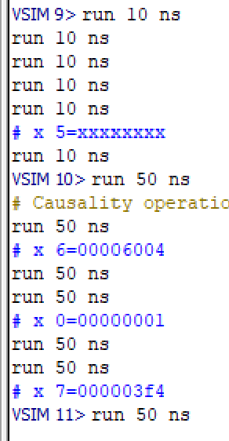
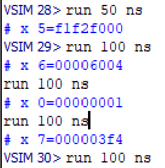
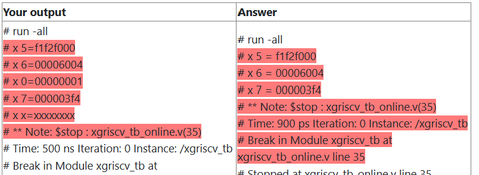
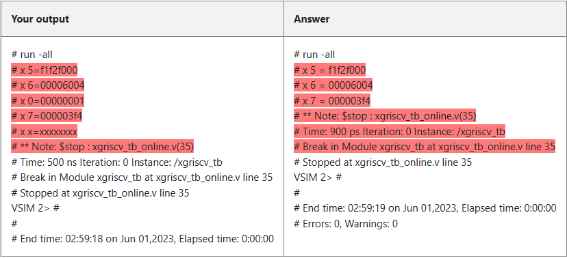
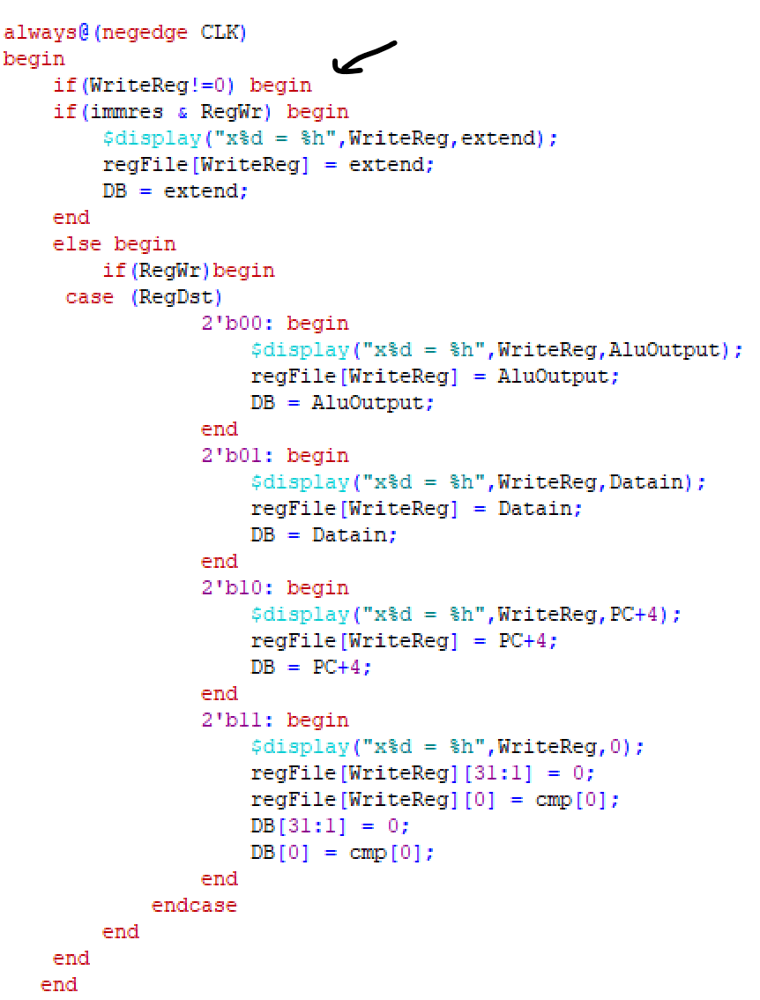
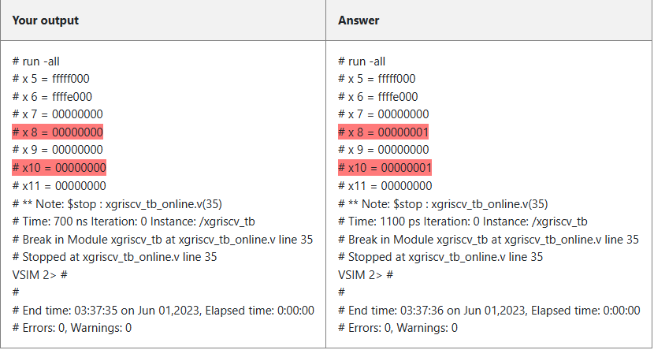
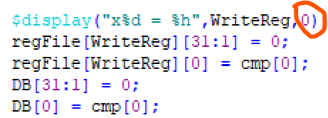
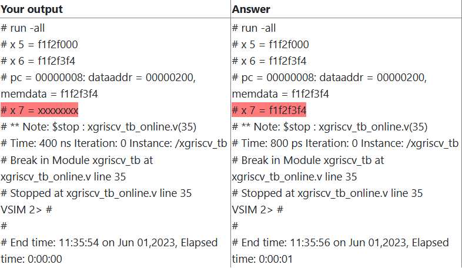
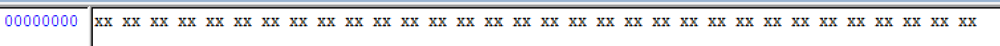
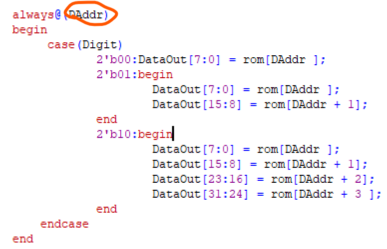

# cod-singlecyclecpu
# 这是武汉大学计算机学院计算机组成与设计课程设计的一部分
# RISC-V 单周期实现
# Yipan Wei
# 2023.06.2

以下是我的进度：
- [x] 完成本地单周期处理器实现与本地测评
  
- [x] 完成本地测试集1测评
- [x] 完成希冀平台测试集1测评
- [x] 完成本地测试集2测评
- [x] 完成希冀平台测试集2测评
- [x] 完成本地测试集3测评
- [x] 完成希冀平台测试集3测评
- [x] 完成本地测试集4测评
- [x] 完成希冀平台测试集4测评
- [x] 完成本地测试集5测评
- [x] 完成希冀平台测试集5测评
- [x] 完成本地测试集6测评
- [x] 完成希冀平台测试集6测评
- [x] 完成本地测试集7测评
- [x] 完成希冀平台测试集7测评
- [x] 完成本地测试集8测评
- [x] 完成希冀平台测试集8测评
  
- [x] 完成希冀平台测评

---

### 我使用的是自己设计的CPU，可能会遇到很多问题。
#### 在这里我会记录下这些问题并将其解决。

### 代码跑不动？！
没有想到刚开始提交就遇到了第一个问题：   
个人感觉：*代码测试**说明**确实写的乱的不行，感觉跟笔记一样。*  

第一个问题在于，似乎Gitlab上龚老师提供的接口和蔡老师发的修改思路不太一样。在确认之后，还是按照蔡老师发的修改。但是本地仍然有问题。  

看了以下波形图，发现无论如何运行PC都不变，这时我觉得不太对，PC应该是根据时序发生改变的，之前测试过PC应该是正常的。  
查看波形图之后似乎发现，原因出在**control**上，control在读取控制指令之后没有读出结果，这导致其他部件的*控制指令*瘫痪，最终导致CPU无法正常运转。
在经过Control文件再一次的test之后，确认Control本身是可以正常读取的，也可以正常解码的，现在不知道问题出在哪里。 
   
现在经过思考之后，问题应该出在PC的连线上？  
首先经过修改的是pcW,之前没有将pcW考虑为引线连接到各个元件，而是将其作为一个单纯的输出，一直在想办法输出，现在将其作为一个引线连接应连接的元件。
**但是PC仍然不改变**，观察波形图之后发现reset一直为1，这显然不正确，根据我设计的CPU，当上升沿时钟来临，并且reset=1时，PC会置0。经过查找发现是reset定义出了问题，不应该**取反**（也不知是从哪看到的取反），修改后现在PC可以正常。  
以下是第一次顺利运行的输出：  

  
 可以看到，x5的值仍然有问题，并且x0没有强制为0（但是我的想法是读取x0时永远为0，这个先待定）  
 经过检查仿真波形之后，发现是有一个信号没有设置，那就是immres信号，这个信号在我的CPU中是用来确定rd的值是RedDst决定还是立即数。  
 重新修改Control之后，再次仿真。  
 以下是第二次仿真的结果，我现在需要进入平台测试。  
   
 以下是第一次上机之后的结果，虽然两个结果一样但是还是判错，经过对比发现是格式（空格）的问题：
      
 修改后重新提交，测试全部测试集。

---

 在全部提交之后，只有三和四是正确的，其余都多少有点问题。
   
以下我们一一解决：
### 测试集1：
测试集1的汇编代码为：  
    lui 	x5, 0xF1F2F	  
	auipc	x6, 0x6	   
	addi	x0, x0, 1  
	addi	x7, x0, 0x3F4  
机器代码为：  
    f1f2f2b7  
    00006317  
    00100013  
    3f400393  

 命令台的输出和我们的输出：
    

  - 可以看到，首先一个不同点就在于Answer没有输出x0，这是需要设置的，我们首先修改这一部分代码：
     
  我们在“write”这个操作中，加入了一条判断语句，这样如果要写的是x0，我们就直接跳过。

### 测试集4：
测试集4的汇编代码为：  
        lui     x5, 0xfffff             #x5 <== 0xFFFFF000  
        lui     x6, 0xffffe             #x6 <== 0xFFFFE000  
        slt     x7, x5, x6              #x7 <== 0x00000000  
        slti    x8, x5, 1               #x8 <== 0x00000001  
        sltu    x9, x5, x6              #x9 <== 0x00000000  
        sltiu   x10, x5, -2048          #x10 <== 0x00000001  
        sltiu   x11, x5, 1              #x11 <== 0x0000000  

机器代码为：  
  fffff2b7  
  ffffe337  
  0062a3b3  
  0012a413  
  0062b4b3  
  8002b513  
  0012b593  

 命令台的输出和我们的输出：
   
可以看到，我们的问题在于x8,x10没能正常运行slti指令和sltiu指令,接下来我们本地仿真查看波形来确认问题出在哪里：  
首先我们可以肯定，slti和sltiu的功能都是 (rs1<imm)?1:0,所以我们初步推测问题出在**大于小于等于**这件事上。  
检查代码之后，发现错误的原因很奇怪，但确实是错了，在查看RegFile文件之后，我惊奇的发现竟然写错了，也不知道当时是怎么想的，让他显示的是一个常数0，可能CPU内部是正确的，但显示错误了。  
   
在修改之后，我再一次观察本地波形图，发现命令台输出和预期仍然不太一致。  
  
发现x11又出了问题，在观察ALU后，我们发现ALU似乎不能正确地执行sltiu这一*无符号数*比较指令。  
在观察波形图和控制信号后，发现问题出在sign这个信号上，执行无符号比较指令中，立即数应该是二进制数值被CPU解析为是有符号还是无符号，而不是简单的**去掉**符号位，进行简单的0扩展，此时需要修改CPU中控制信号和ALU的功能。  
那么sign这个信号应该是传入ALU中，在ALU中决定是有符号数还是无符号数。一个比较好的事情是verilog中默认数据是无符号数，所以我们只需要加上一点点判断条件即可。（注意修改后的接口也需要更新）  
修改过后本地很容易就通过了，在平台上测试也通过了。

---

比较神奇的是，修改完前面几个错误后，测试集5，6也通过了，现在来修改测试集7

---

### 测试集7：
测试集7的汇编代码为：  

lui 	x5, 0xF1F2F  
addi	x6, x5, 0x3F4    
sw		x6, 0x200(x0)  
lw		x7, 0x200(x0)

机器代码为：  
  f1f2f2b7  
  3f428313  
  20602023  
  20002383  
一个比较简单的store 和 load指令，这是测试结果：
    
很显然，错误出在lw这条指令上，它没有正确地将内从中的值从memory中取出来，查看之后发现是分配空间太少了，以至于根本没存上去。。。  
   
查看龚老师的代码后，发现她分配了4096个字节的空间（1024个字，我用的是字节所以就是1024*4），但是修改字节大小之后仍然没有效果。查看波形图之后发现似乎是数据读不出来，查看代码后发现是代码有问题：
  
这段代码当前后的DAddr**不变**时，便不会取出内容，这并不是我的本意，应该让每次时钟来决定是否取值，根据risc-v指令集，我选择上升沿取，修改后在本地再次测试通过，平台测试也同样通过。

### 测试集8
没想到前面都通过了最后一个还是没通过。  
平台显示的结果是"运行时间过长"，问了一下同学发现可能是跳转指令出了问题，现在在本地先进行一次仿真，结果应该是没问题的，我推测结果可能是时间的问题，我修改了时间范围之后，重新上传到了测试平台。
似乎还是有问题  
查看了平台的指令之后，发现是最后没有跳转，问题应该在于regfile没有初始化。  
但是初始化之后，仍然无法正确运行，在查看元件连线和波形图之后，确认是当lw指令执行时，dataout（Mem输出）没有正确输出，当系统需要时输出了xxxxxxxx。查看DataMEM之后，发现有点时序的问题。在这里为了简单起见，我让datamen**持续输出**，只要有Address就输出内容，这一改动不会对其他内容有影响，因为仅仅向数据线上输出内容，但是其他元件的“写”是不可用的，所以是没有影响的（参考RegFile持续输出ReadData1和ReadData2）

## 总结
单周期处理器的设计是一个比较耗时间的过程，它不光要求我需要对每一个元件有着深刻的理解，还需要我对整体的组成有着一个较为完全的把握。

---

下一步就是设计流水线辣